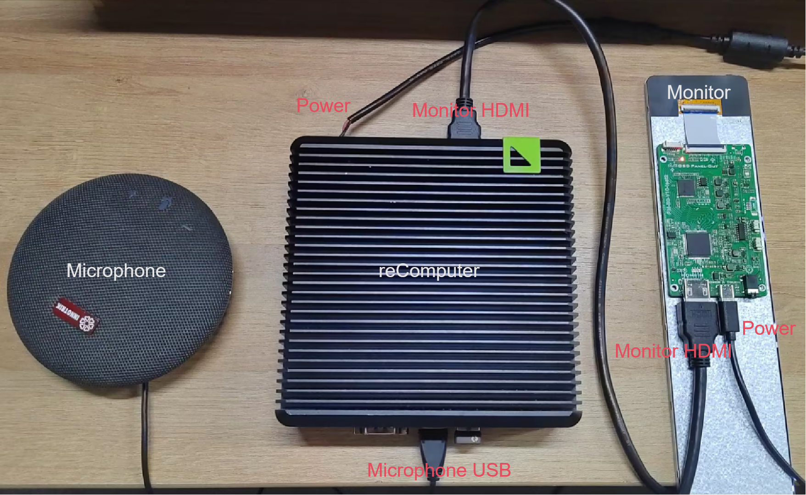

# Speech Subtitle Generation on Jetson

In this project, we use the [Riva ASR Server](https://catalog.ngc.nvidia.com/orgs/nvidia/teams/riva/resources/riva_quickstart) to capture data from the microphone input in real-time and display it on a webpage.

## Requirement

- [reComputer](https://www.seeedstudio.com/reComputer-Industrial-J3011-p-5682.html?queryID=c1e6f0b0bd38a98233ce64bce8083a22&objectID=5682&indexName=bazaar_retailer_products) (Or other devices based on Jetson)
- [reSpeaker](https://www.seeedstudio.com/ReSpeaker-Mic-Array-v2-0.html?queryID=2baffb980bdb6d5e65b2b3f511657cb2&objectID=139&indexName=bazaar_retailer_products) (Or other USB interface microphones)
- Monitor, mouse, and keyboard 



## Prepare the runtime environment

Use the following command to install the runtime environment:

```shell
# flask
pip3 install flask
# riva client
git clone --depth=1 --recursive https://github.com/nvidia-riva/python-clients
cd python-clients
sudo pip3 install --upgrade pip setuptools wheel
pip3 install --no-cache-dir --verbose -r requirements.txt
python3 setup.py --verbose bdist_wheel
pip3 install --no-cache-dir --verbose dist/nvidia_riva_client*.whl
python3 -c 'import riva.client; print(riva.client.__version__)'
# pyaudio
sudo apt-get install -y --no-install-recommends python3-pyaudio
```

## Let's run it

```shell
git clone ...
cd ...
python3 recorder.py
```

## Run results
(coming soon)